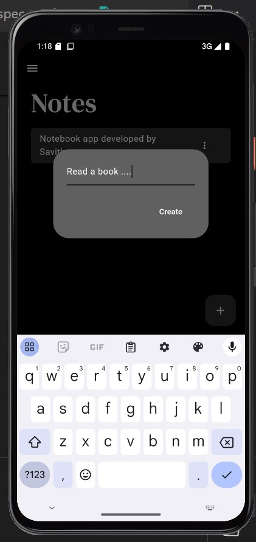

# Notes App

 Notes App, Designed for efficient note-taking and management. This app uses `isar` as the local database for seamless storage and retrieval of notes, offering a smooth user experience with robust features and a sleek interface.

## Key Features

- **Create Notes**: Quickly jot down new ideas or thoughts.
- **Edit Notes**: Easily update existing notes with a simple tap.
- **Delete Notes**: Remove unwanted notes with a swipe.
- **Dark Mode**: Switch between light and dark themes for optimal viewing comfort.
- **Visual Interface**: Enjoy a visually appealing design that enhances usability.

## Screenshots

Explore the app's interface with these snapshots:

 **Home**: 
   

 **Sidebar**: 
   

 **icon**: 
   

   

   

   

   

### developed by Savitha 